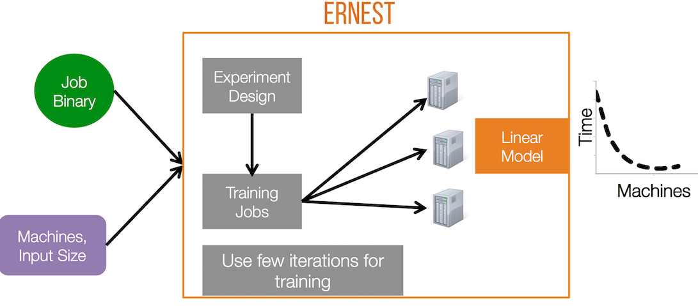

## Ernest: Efficient Performance Prediction for Advanced Analytics

Ernest is a performance prediction framework for analytics jobs developed using frameworks like Apache Spark and run on cloud computing infrastructure. 

One of the main challenges in deploying large scale analytics applications in
the cloud is choosing the right hardware configuration. Specifically in Amazon
EC2 or Google Compute Engine clusters, choosing the right instance type and the
right number of instances can significantly improve performance or lower cost. 

Ernest is a performance prediction framework that helps address this problem.
Ernest builds performance models based on the behavior of the job on small
samples of data and then predicts its performance on larger datasets and cluster
sizes. To minimize the time and resources spent in building a model, Ernest
uses [optimal experiment design](https://en.wikipedia.org/wiki/Optimal_design),
a statistical technique that allows us to collect as few training points as
required. For more details please see our [paper]
(http://shivaram.org/publications/ernest-nsdi.pdf) and [talk slides](http://shivaram.org/talks/ernest-nsdi-2016.pdf) from NSDI 2016.

### Configing Runtime Environment

We recommend using conda to create the clean environment for running the python code. 

Regarding how to install conda, see [this](https://conda.io/projects/conda/en/latest/user-guide/install/index.html).

```
conda create -n ernest_env python=3.7

conda activate ernest_env

pip install -r requirements.txt
```


### Using Ernest

At a high level there are three main steps to use Ernest as summarized in the following figure.

<p style="text-align: center;">
  
</p>

These include:

1. Determining what sample data points to collect. To do this we will be using experiment design
   implemented in [expt_design.py](expt_design.py). This will return the set of training data points
required to build a performance model.  
2. Collect running time for the set of training data points. These can be executed using [Spark EC2
   scripts](http://github.com/amplab/spark-ec2) or Amazon EMR etc.
3. Building a performance model and using it for prediction. To do this we create a CSV file with
   measurements from previous step and use [predictor.py](predictor.py). 

For a more detailed example you can see our [example](examples/mllib_rcv1.md) on building a
performance model for Spark MLlib algorithms.


## Adapting Ernest to Jasper Scenario


<p style="text-align: center;">
  
</p>

Based on the figure above, we know that Jasper will have three parameters $\theta_0$, $\theta_1$, and $\theta_2$.

Ernest uses [Non-Negative Least Square Method (NNLS)](https://en.wikipedia.org/wiki/Non-negative_least_squares) to solve these parametes. Here, one thing to note is, [predictor.py](predictor.py) adopts the scipy's optimizer to do NNLS, and the [documentation](https://docs.scipy.org/doc/scipy/reference/generated/scipy.optimize.nnls.html#scipy.optimize.nnls) indicates that NNLS only calculates $\theta_1$, and $\theta_2$ and it does not assume $\theta_0$ exists in the model. The more complete solution should do standard normalization with the training data first, to counteract the $\theta_0$ item. However, we beleive $-w$ is trivial compared with the other items, for simplicity, we directly use NNLS and only focus on $\theta_1$, and $\theta_2$. 


## Procedure

The procedure can be divided into three steps.

- Step 1: run expt_design.py to generate the experiments we want to run. When running it, we need to specify the bounds for the depth and fanout factors. These are the two key varaibles to control our experiments. For example,

   ```
   python expt_design.py \
   --min-parts 4 --max-parts 32 --total-parts 256 \
   --depth-min=1 --depth-max=6 --fanout-min=10 --fanout-max=25
   ```

   The min-parts, max-parts, total-parts are the original parameters of Ernest, we do not touch them. The last four parameters are customized by ourseleve.

   <p style="text-align: center;">
  
   </p>

- Step 2: Based on the samples collected in Step 1, run these experiments in real testbed and record their running time. Record them into a csv file, see the format in [example.csv](example.csv)

- Step 3: The example.csv will serve as the training data. We use predictor.py to train (fit) a NNLS model, and the model will be used to predict the run time cost given a <Depth, Fanout> setting.

   ```
   python predictor.py --csv-path="example.csv"
   ```
   <p style="text-align: center;">
  
   </p>


## Running Jasper
- python3 run.py create-template -r 10 -p 1 -b 10 -red 0 -c 1 -rm dpdk -d 1 -dm large -conf 0
- python3 run.py deploy-stack -dm large


